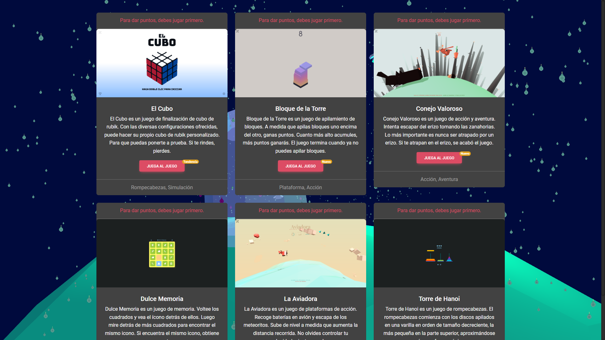
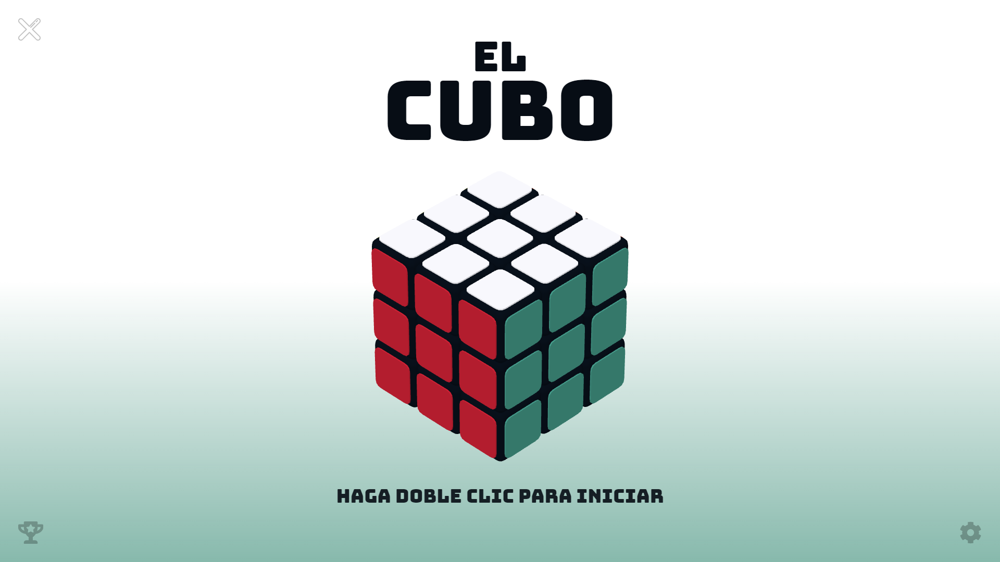
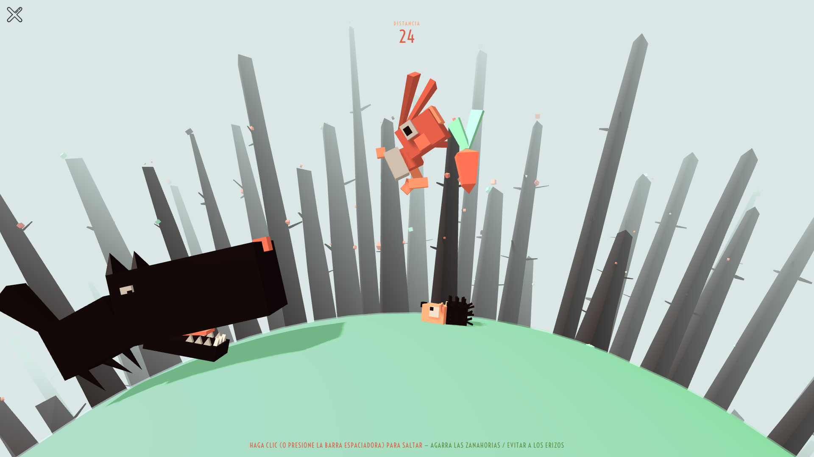
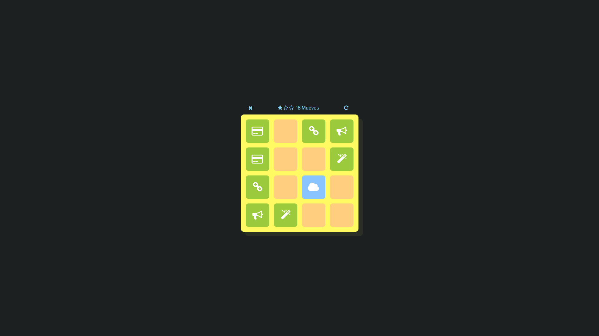
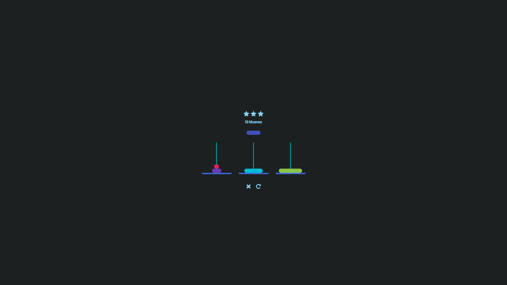
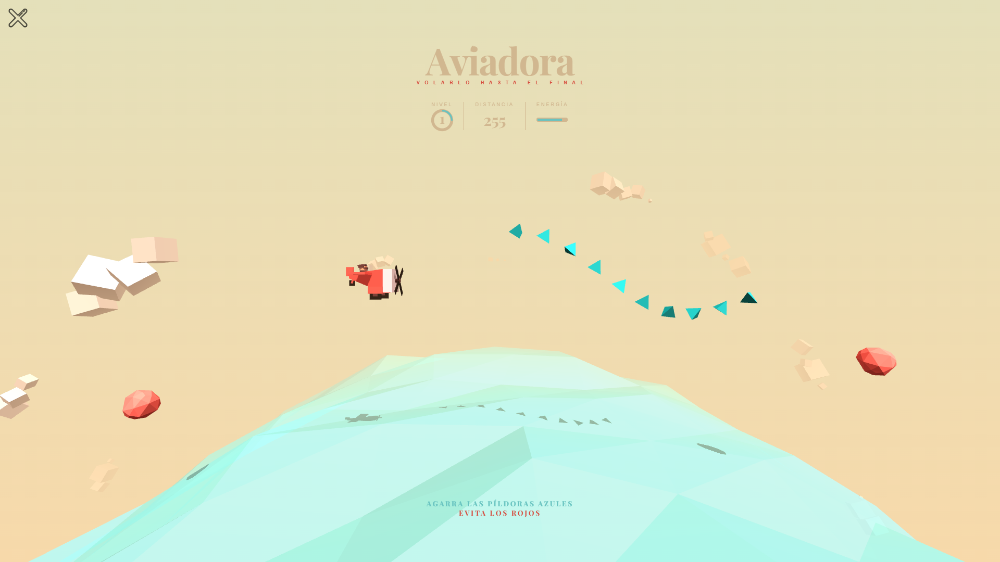

  

  <b>Lunox</b> es un Kit de Herramientas de Utilidad Universal personalizable, moderno y avanzado.

<h4 align="center">
  <a href="https://github.com/Soferity/GamePortal/issues">Cuestiónes</a>
  •
  <a href="https://github.com/Soferity/GamePortal/discussions">Discusiónes</a>
  •
  <a href="https://github.com/Soferity/GamePortal/wiki">Documentación</a>
  •
  <a href="https://discord.gg/nxG977byXb">Discord</a>
</h4>

  
  
  
  
  
  

  
  
  
  

  
  

  
  

  
  

  

  
  
  

  <!--
  -->
  
  
  

---

# ¿Qué es Lunox?

  
Ver Más Capturas de Pantalla

  
  
  
  
  
  

Lunox le permite realizar fácilmente conversiones de unidades, conversiones de archivos, operaciones OCR, operaciones QR, operaciones HTML-CSS-JS-JSON y muchas otras operaciones líderes con la diversa infraestructura que ofrece. Algunas características de Lunox en resumen son:

-   Se ve moderno
-   Amplia variedad
-   Personalizable
-   Fácil de usar
-   Lo más importante, ¡Es un Software de Código Abierto (OSS)!

Lunox se encuentra actualmente en un fuerte desarrollo. Puede dar sus sugerencias y comentarios en nuestra página de [Discusiones](https://github.com/Soferity/GamePortal/discussions). Si se siente cómodo escribiendo código usando C# (.NET), le recomendamos encarecidamente que [contribuya a este proyecto](https://github.com/Soferity/GamePortal/graphs/contributors).

---

## Requisitos del Sistema

- **Windows 11**
- **Windows 10 1809 y superior**

---

## Instalación

Lunox está disponible para que lo instales a través de [Microsoft Store](https://www.microsoft.com/store/apps/9PC06S6LW868), [GitHub](https://github.com/Soferity/GamePortal/releases/latest).

Todos los métodos de distribución mencionados anteriormente son compatibles, sin embargo, se **recomienda** instalar la aplicación desde **Microsoft Store**, ya que es más fácil de instalar y se mantendrá actualizada automáticamente.

**Microsoft Store**

**GitHub**

**Si Windows Pregunta acerca de la Aplicación que no es de Confianza**

* Simplemente haga clic derecho en MSIX y haga clic en Propiedades
* Ir a la pestaña Firmas Digitales
* Seleccione Taiizor(BAEB534D-BC36-4432-8EEF-E0088D896FB9) y haga clic en Detalles
* En la siguiente ventana emergente, seleccione Ver Certificado
* En la siguiente ventana emergente, seleccione Instalar Certificado
* En el siguiente paso, seleccione Máquina Local (Si aparece una solicitud de cuenta de usuario, haga clic en Sí)
* Seleccione Colocar todos los certificados en el siguiente almacén y haga clic en Examinar, seleccione Personas de confianza y haga clic en Aceptar y Siguiente
* Haga clic en Finalizar
* Aparecerán ventanas de confirmación Después de eso, Intente Instalar MSIXBUNDLE

---