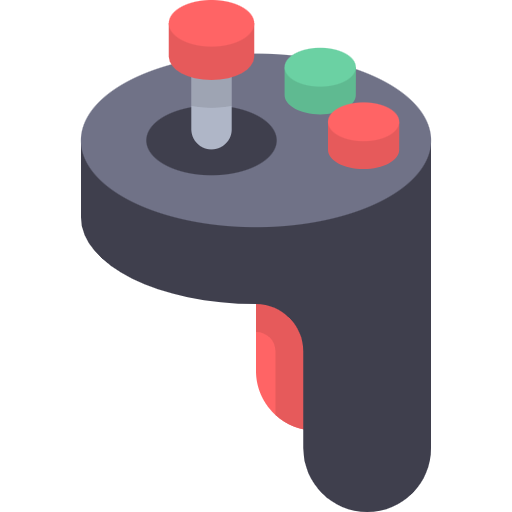
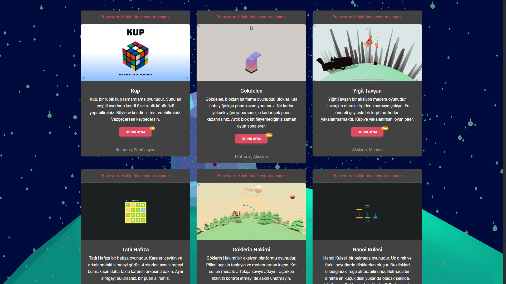
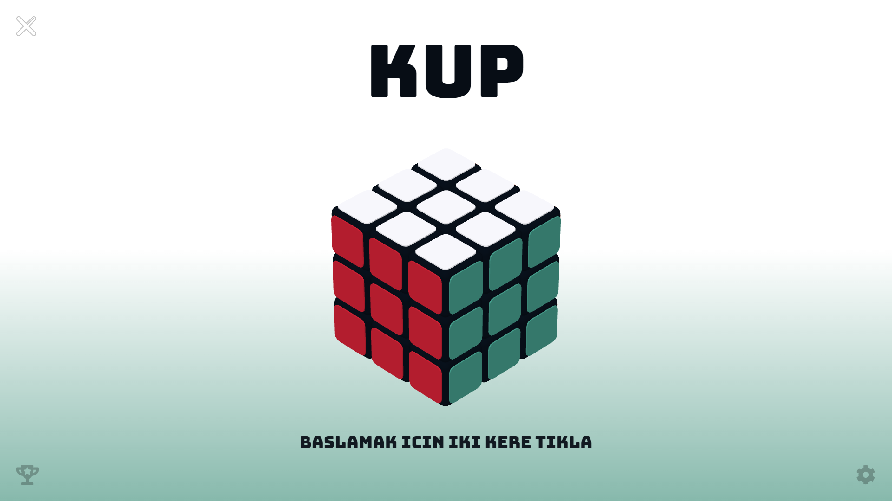
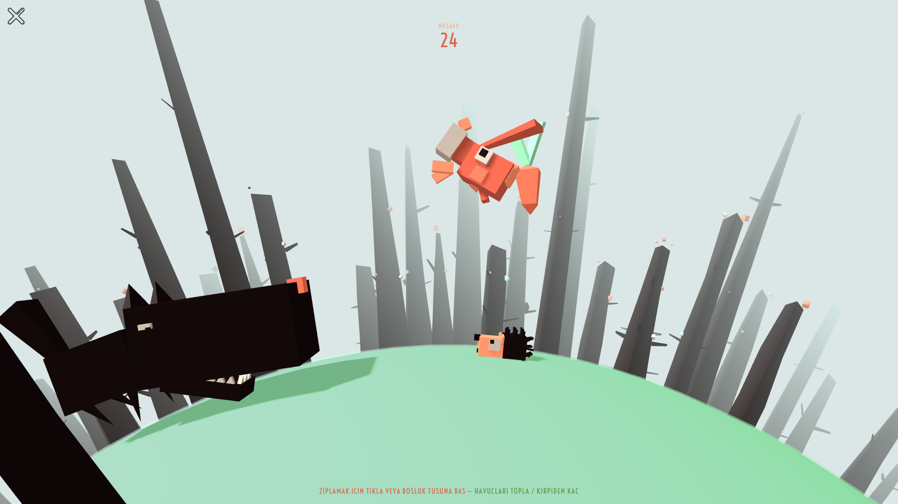
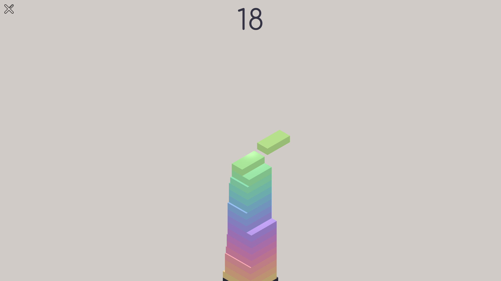
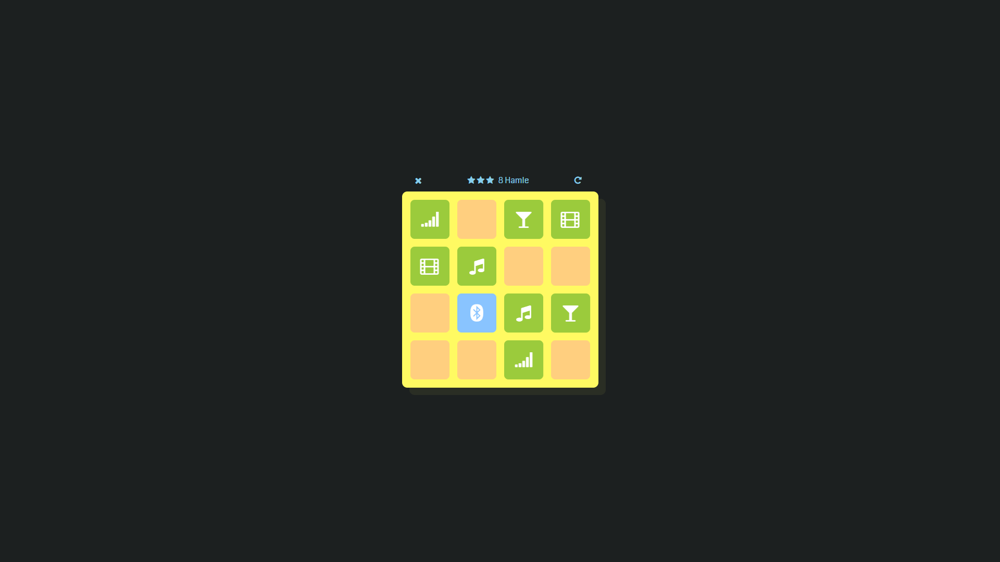
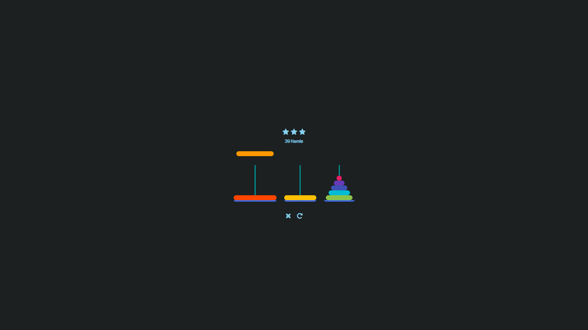

  

  <b>Soferity: Game Portal</b> bir oyun portalıdır. Sunduğu çeşitli oyun türleri ile eğlenceli ve güzel vakit geçirmenizi sağlar.

<h4 align="center">
  <a href="https://github.com/Soferity/GamePortal/issues">Sorunlar</a>
  •
  <a href="https://discord.gg/nxG977byXb">Discord</a>
</h4>

  
  
  

  <!--
  -->
  
  
  

---

# Soferity: Game Portal Görüntüleri

  
Daha Fazla Ekran Görüntüsü Görüntüle

  
  
  
  
  

---

## Sistem Gereksinimleri

- **Windows 11**
- **Windows 10 2004 ve üzeri**

---